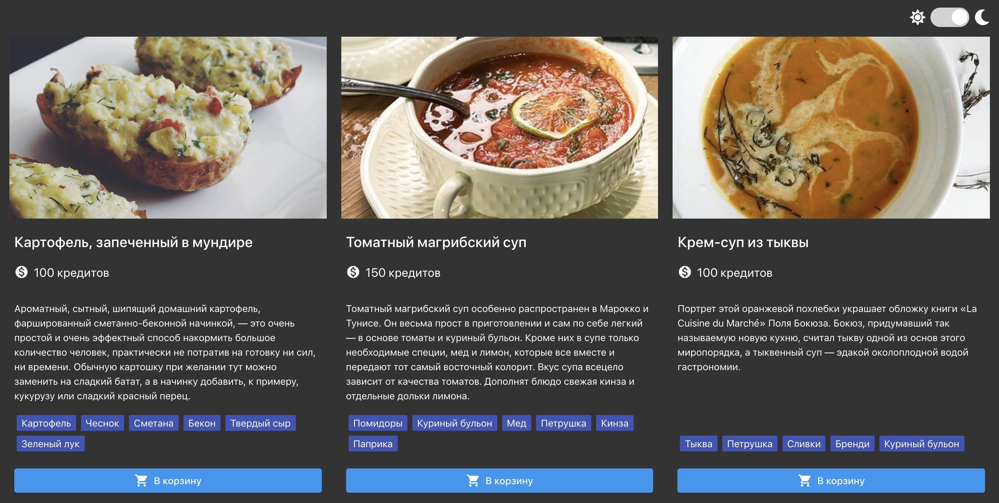

# **Food Service**

# Реализация

 

- Используется
  [parcel-project-template](https://github.com/goitacademy/parcel-project-template)
  для сборки и деплоя проекта.

## Тема

Добавлен функционал изменения темы при нажатии (событие `change`) на чекбокс
`#theme-switch-toggle` в тулбаре.

- По умолчанию тема светлая.
- При изменении темы, элементу `body` присваивается `light-theme`
  или `dark-theme`.
- Выбранная тема сохраняеться между перезагрузками страницы. Для хранения
  темы используется `localStorage`.
- При загрузке страницы темной темы поставлено свойство `checked`
  у чекбокса `#theme-switch-toggle` в `true`, чтобы ползунок сдвинулся в
  правильное положение.

## Шаблонизация

Используется шаблонизатор [Handlebars](https://handlebarsjs.com/)

Для иконок используется библиотека `Material Icons`